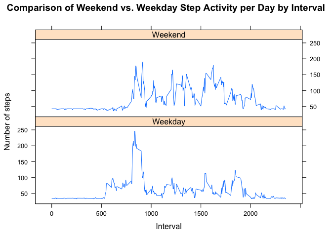

# Reproducible Research: Peer Assessment 1
Chad Salinas  
October 25, 2016  


## Loading and preprocessing the data

```r
MyData <- read.csv("activity.csv", header=TRUE, sep=",")
MyData[MyData == 0] <- NA
```

## What is total number of steps taken per day?

```r
MyData$date <- as.Date(MyData$date,"%Y-%m-%d")
sumData <- aggregate(steps ~ date, data = MyData, sum)  # Calculate step totals

# Graph total steps by day
ggplot(sumData, aes(date, steps)) +
        ggtitle("Total Steps by Day") + 
        labs(x="Day", y="Total Steps") +
        stat_summary(fun.y = sum, geom = "bar")
```

<!-- -->

## What is mean number of steps taken per day?

```r
# Graph mean steps by day
meanData <- aggregate(steps ~ date, data = MyData, mean, na.rm=TRUE)  # Calculate step mean
ggplot(meanData, aes(date, steps)) +
        ggtitle("Mean Steps by Day") + 
        labs(x="Day", y="Mean Steps") +
        stat_summary(fun.y = mean, geom = "bar")
```

<!-- -->

## What is median number of steps taken per day?

```r
# Graph median steps by day
medianData <- aggregate(steps ~ date, data = MyData, median, na.rm=TRUE)  # Calculate step median
ggplot(medianData, aes(date, steps)) +
        ggtitle("Median Steps by Day") + 
        labs(x="Day", y="Median Steps") +
        stat_summary(fun.y = median, geom = "bar")
```

<!-- -->

## What is the average daily activity pattern?

```r
MyData <- read.csv("activity.csv", header=TRUE, sep=",")
ggplot(MyData, aes(interval, steps)) + geom_line(color = "blue") +
        ggtitle("Steps by Interval") +
        xlab("5-Min Intervals") +
        ylab("Steps") + 
        stat_summary(fun.y = "max", color = "red", size = 1, geom = "point")
```

```
## Warning: Removed 2304 rows containing non-finite values (stat_summary).
```

```
## Warning: Removed 2 rows containing missing values (geom_path).
```

<!-- -->

```r
sumInterval <- aggregate(steps ~ interval, data = MyData, sum)  # Calculate step totals by interval
maxRow <- sumInterval[which.max(sumInterval[,2] ), ]
maxRow[1,1]
```

```
## [1] 835
```

## Imputing missing values
### Calculate and report the total number of missing values in the dataset 

```r
sum(is.na(MyData))
```

```
## [1] 2304
```

### Fill missing values into new dataset with the mean for that day

```r
fillData <- MyData
library(plyr)
lookup <- aggregate(steps ~ date, data = MyData, mean, na.rm=TRUE)
imputedMeanData <- merge(fillData, lookup, by = "date")
imputedMeanData$steps.x[imputedMeanData$steps.x == 0] <- (imputedMeanData$steps.y[imputedMeanData$steps.x == 0])
```

## What is total number of steps taken per day with No Missing Values?

```r
imputedMeanData$date <- as.Date(imputedMeanData$date,"%Y-%m-%d")
sumData <- aggregate(steps.x ~ date, data = imputedMeanData, sum)  # Calculate step totals

# Graph total steps by day
ggplot(sumData, aes(date, steps.x)) +
        ggtitle("Total Steps by Day") + 
        labs(x="Day", y="Total Steps") +
        stat_summary(fun.y = sum, geom = "bar")
```

<!-- -->

## What is mean number of steps taken per day with No Missing Values?

```r
# Graph mean steps by day
meanData <- aggregate(steps.x ~ date, data = imputedMeanData, mean, na.rm=TRUE)  # Calculate step mean
ggplot(meanData, aes(date, steps.x)) +
        ggtitle("Mean Steps by Day") + 
        labs(x="Day", y="Mean Steps") +
        stat_summary(fun.y = mean, geom = "bar")
```

<!-- -->

## What is median number of steps taken per day with No Missing Values?

```r
# Graph median steps by day
medianData <- aggregate(steps.x ~ date, data = imputedMeanData, median, na.rm=TRUE)  # Calculate step median
ggplot(medianData, aes(date, steps.x)) +
        ggtitle("Median Steps by Day") + 
        labs(x="Day", y="Median Steps") +
        stat_summary(fun.y = median, geom = "bar")
```

<!-- -->

##### These values differ from the estimates from the first part by increasing total number of steps, decreasing mean number of steps, and decreasing median # of steps. 


## Are there differences in activity patterns between weekdays and weekends?

```r
library(lattice)
imputedMeanData$date <- as.Date(imputedMeanData$date)
imputedMeanData$date <- strptime(paste(imputedMeanData$date), format="%Y-%m-%d")
weekdays <- c("Monday", "Tuesday", "Wednesday", "Thursday", "Friday")
imputedMeanData$weekday <- paste(weekdays(imputedMeanData$date))

# Turn Mon-Fri into "Weekday"" and Sat. Sun. into "Weekend""
imputedMeanData$weekday = as.factor(
        ifelse(is.element(weekdays(as.Date(imputedMeanData$date)), weekdays), "Weekday", "Weekend"))
agInterval <- aggregate(steps.x ~ interval + weekday, imputedMeanData, mean)

xyplot(agInterval$steps.x ~ agInterval$interval | agInterval$weekday, 
       main="Comparison of Weekend vs. Weekday Step Activity per Day by Interval", 
       xlab="Interval", 
       ylab="Number of steps", 
       layout=c(1,2), 
       type="l")
```

<!-- -->
